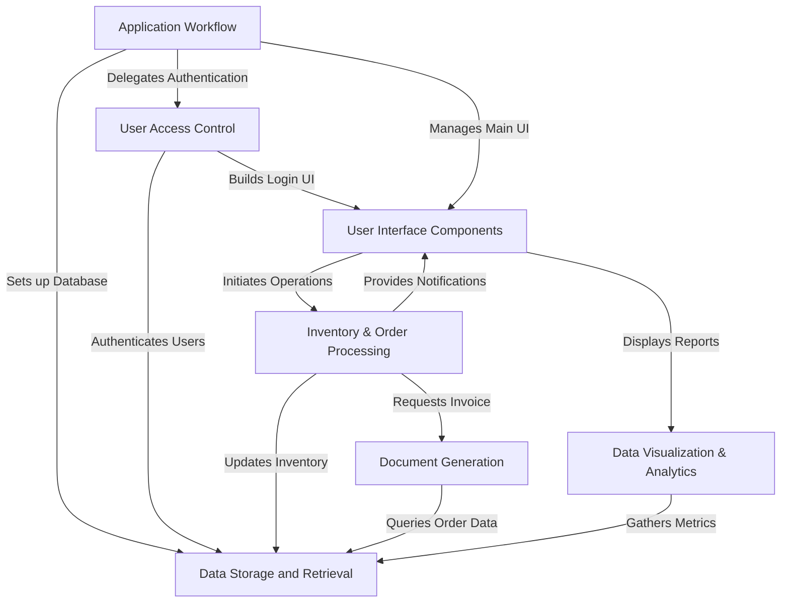
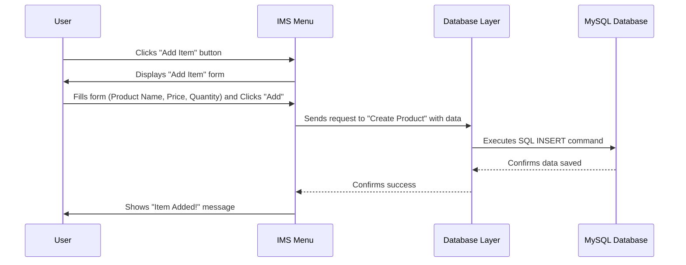
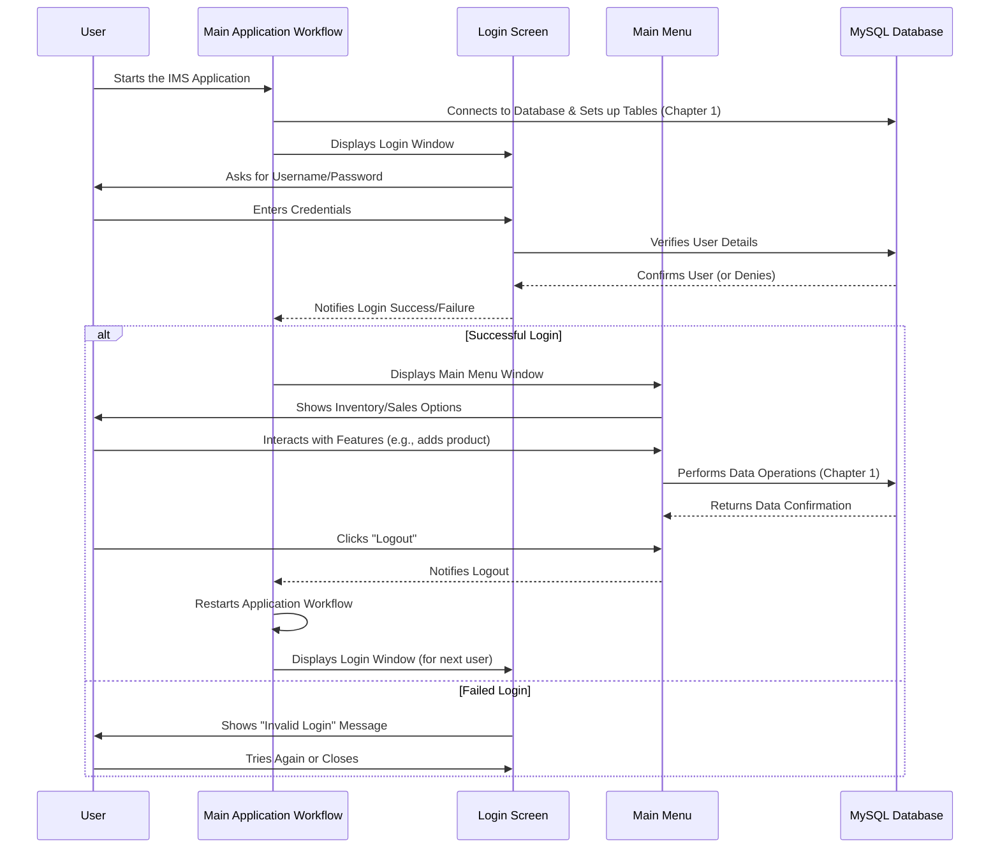
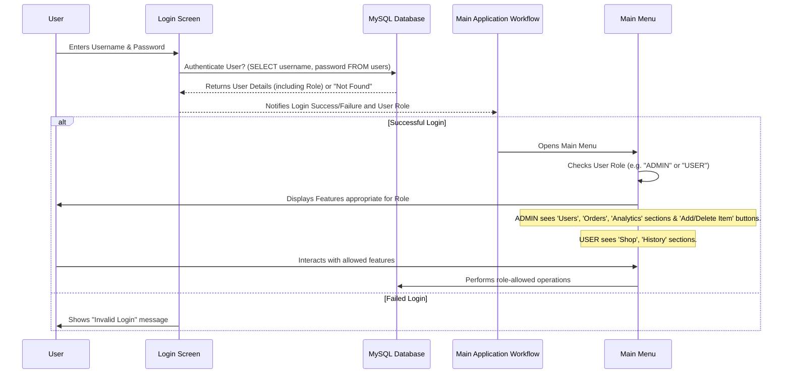
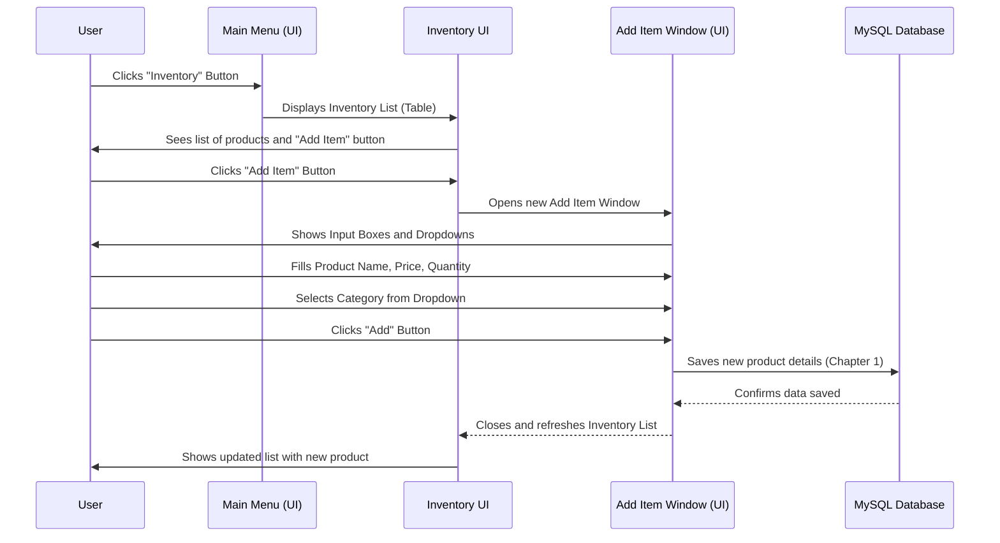
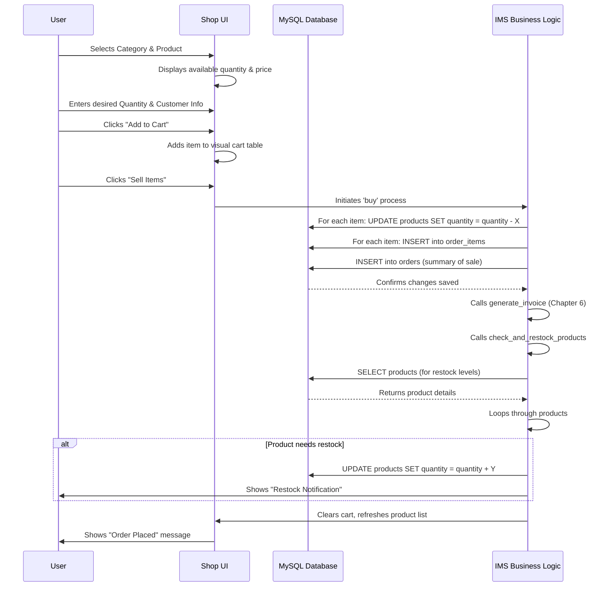
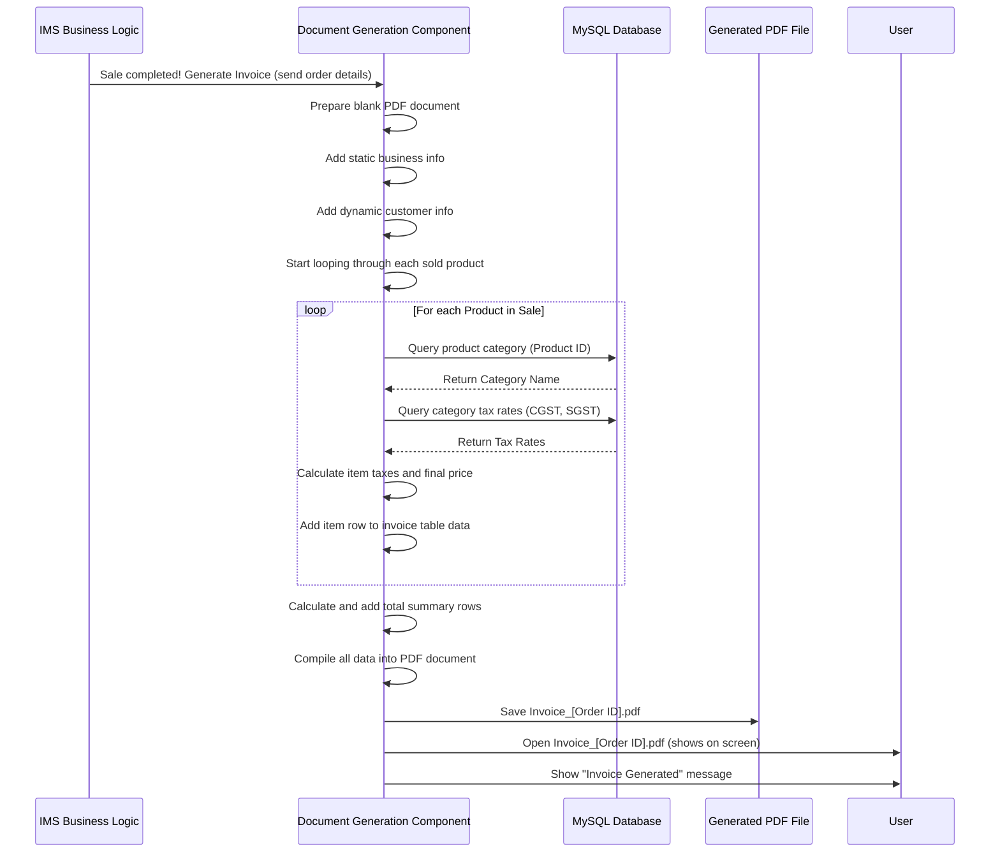
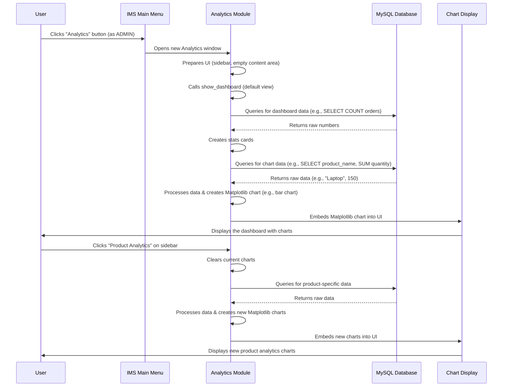

# Inventory-Management-System

This project is an **Inventory Management System** designed to help businesses efficiently track their *products*, *process sales*, and *manage customer orders*. It allows users to log in, maintain a detailed inventory, handle transactions, generate professional *invoices*, and visualize key business *performance metrics* through interactive charts and reports.


## Visual Overview



## Chapters

1. [Data Storage and Retrieval
](01_data_storage_and_retrieval_.md)
2. [Application Workflow
](02_application_workflow_.md)
3. [User Access Control
](03_user_access_control_.md)
4. [User Interface Components
](04_user_interface_components_.md)
5. [Inventory & Order Processing
](05_inventory___order_processing_.md)
6. [Document Generation
](06_document_generation_.md)
7. [Data Visualization & Analytics
](07_data_visualization___analytics_.md)

---


# Chapter 1: Data Storage and Retrieval

Welcome to the first chapter of our Inventory Management System (IMS) tutorial! In this chapter, we'll explore one of the most fundamental concepts: how our system stores and retrieves all the important information it needs to run a shop effectively.

### Why Do We Need Data Storage?

Imagine you own a small shop. Every day, you sell products, receive new stock, and interact with customers. How do you keep track of everything?
*   What products do you have?
*   How many of each product are left?
*   What's the price of each item?
*   Who are your customers?
*   What orders have been placed?

If you tried to remember all this in your head, or write it on sticky notes, it would quickly become a huge mess! This is where "Data Storage and Retrieval" comes in. It's like having a super-organized digital filing cabinet for your shop. Our IMS uses this system to meticulously organize and easily find all the records about your products, sales, and users.

Let's take a common task: **Adding a brand-new product to your inventory**. This simple action involves storing new data and is a great way to understand this concept.

### Key Concepts of Data Storage

To manage information, our IMS relies on a **database**. Think of a database as a large library where all your shop's information is kept.

Inside this library, information is organized into **tables**, which are like specific sections or folders. For example, you might have a table for "Products", another for "Orders", one for "Users", and so on.

Each table has **columns** (also called fields), which define the type of information stored. For instance, in the "Products" table, you might have columns for "Product Name", "Price", and "Quantity". Each individual product or order is a **row** (or record) in these tables.

The main actions we perform on our data are often remembered by the acronym **CRUD**:
*   **Create (Saving)**: Adding new information, like a new product or a new customer order.
*   **Read (Retrieving/Querying)**: Looking up existing information, like checking how many items are left or viewing a customer's past orders.
*   **Update (Modifying)**: Changing existing information, such as updating a product's price or quantity after a sale.
*   **Delete (Removing)**: Getting rid of old or irrelevant information, like removing a discontinued product.

### How the IMS Uses Data Storage: Adding a Product Example

When you use our Inventory Management System to add a new product:

1.  You'll interact with the user interface to enter details like the product's name, price, and quantity.
2.  Once you click "Add," the IMS takes this information.
3.  It then sends this information to the "Data Storage and Retrieval" part of the system.
4.  This part knows exactly how to store your new product details correctly in the "Products" table in our database.

Let's see this process visually:


*Explanation*: The user interacts with the IMS menu. When they want to add a product, the menu sends the product's details to the "Database Layer." This layer is responsible for speaking the database's language (SQL) and tells the "MySQL Database" to save the new information. Once saved, confirmations are sent back up the chain to the user.

### Under the Hood: The Database Connection and Operations

Our IMS uses **MySQL** as its database. To interact with MySQL, our Python code needs to:

1.  **Connect** to the database.
2.  **Define the structure** of the data (create tables).
3.  Execute **SQL commands** to perform CRUD operations.

Let's look at simplified code examples from our project that demonstrate these steps.

#### 1. Connecting to the Database and Setting Up Tables (`main.py`)

When the IMS application starts, it first establishes a connection to the MySQL database and ensures all necessary tables exist. This is like setting up your filing cabinet with all the right folders before you start putting papers in them.

```python
# IMS/main.py (Simplified)
import mysql.connector as mycon

class Main:
    def __init__(self):
        # Step 1: Connect to the MySQL server
        self.con = mycon.connect(host='localhost', user='root', passwd='manager')
        self.cur = self.con.cursor() # A 'cursor' is like a pointer to execute commands

        # Step 2: Create the 'inventory' database if it doesn't exist
        self.cur.execute("CREATE DATABASE IF NOT EXISTS inventory")
        self.con.database = 'inventory' # Tell Python to use this database

        # Step 3: Create tables if they don't already exist
        self.cur.execute("CREATE TABLE if not exists users (...)")
        self.cur.execute("CREATE TABLE if not exists products (...)")
        self.cur.execute("CREATE TABLE if not exists orders (...)")
        self.cur.execute("CREATE TABLE if not exists order_items (...)")
        self.cur.execute("CREATE TABLE IF NOT EXISTS categories (...)")
        # Note: '...' means columns and their types are omitted for simplicity.
```
*Explanation*: This code snippet shows how the `Main` part of our application connects to MySQL. It then makes sure there's an `inventory` database and creates tables like `users`, `products`, `orders`, `order_items`, and `categories` inside it. These tables are ready to hold our shop's data!

#### 2. Saving New Information (Create/Insert) (`menu.py`)

When you add a new category, for example, the `add_category` function in `menu.py` takes the information you provide and uses an SQL `INSERT` command to add it as a new row in the `categories` table.

```python
# IMS/menu.py (Simplified)
# ... inside the Menu class ...
def add_category(self):
    category_name = self.category_name_entry.get().strip()
    gst = float(self.gst_entry.get().strip())
    cgst = gst / 2
    sgst = gst / 2

    # Check if category already exists (a "Read" operation)
    self.cur.execute(f"SELECT * FROM categories WHERE category_name='{category_name}'")
    if self.cur.fetchall():
        # Handle error if it already exists
        return

    # This is the "Create" operation: Insert new data into the table
    self.cur.execute(
        f"INSERT INTO categories (category_name, GST, SGST, CGST) VALUES ('{category_name}', {gst}, {sgst}, {cgst})"
    )
    self.con.commit() # IMPORTANT: Save changes to the database
    # Show success message and refresh the display
```
*Explanation*: This function first gets the category name and GST percentage from the input fields. It performs a quick check (a "Read" operation) to see if a category with that name already exists. If not, it uses an `INSERT` command to add a new entry to the `categories` table. The `self.con.commit()` line is crucial – it tells the database to permanently save these changes!

#### 3. Retrieving Information (Read/Query) (`menu.py`)

To show you a list of all products in the inventory or all users, the system performs a "Read" operation using an SQL `SELECT` command. The `render_table` function in `menu.py` is a key part of this.

```python
# IMS/menu.py (Simplified)
# ... inside the Menu class ...
def render_table(self, table=None, items=None, query=None):
    # Clear any old data from the display table
    for item in self.tree.get_children():
        self.tree.delete(item)

    # Decide what to fetch: either all from a specific table or results of a custom query
    if table:
        self.cur.execute(f"SELECT * FROM {table};") # Get all data from this table
        items_to_display = self.cur.fetchall()
    elif query:
        self.cur.execute(query) # Execute a specific SQL query
        items_to_display = self.cur.fetchall()
    else:
        items_to_display = [] # No data to display if no table or query

    # Add the fetched data to the application's visual table
    for item in items_to_display:
        self.tree.insert('', 'end', values=item)
```
*Explanation*: The `render_table` function is like asking the database, "Show me everything in the 'products' folder!" or "Show me all orders from today!". It uses `SELECT * FROM [table_name]` to get all the rows. `self.cur.fetchall()` gathers all the results, and then the function displays them neatly in the application's user interface.

#### 4. Modifying Existing Information (Update) (`menu.py`)

When products are sold, their quantities in the inventory need to be reduced. This is an "Update" operation. Similarly, if you remove an item from your shopping cart, its quantity is added back to the inventory.

```python
# IMS/menu.py (Simplified, from `buy` function)
# ... inside the Menu class, specifically within `buy` ...
def buy(self):
    # ... logic to get items from cart ...
    for item_in_cart in self.tree.get_children():
        values = self.tree.item(item_in_cart, "values")
        product_id = values[0]
        quantity_sold = values[4] # Get quantity that was sold

        # This is the "Update" operation: Reduce quantity in the 'products' table
        self.cur.execute(
            "UPDATE products SET quantity = quantity - %s WHERE product_id = %s",
            (quantity_sold, product_id)
        )
    self.con.commit() # Save all changes to the database
    # ... rest of the sales processing ...
```
*Explanation*: When a sale is made (`buy` function), for each item sold, an `UPDATE` command is sent to the database. This command tells the database to *change* the `quantity` of a specific product by subtracting the sold amount. `self.con.commit()` ensures these inventory changes are saved.

#### 5. Removing Old Information (Delete) (`menu.py`)

If a product is no longer sold or is discontinued, you might want to remove it from your inventory. This is the "Delete" operation.

```python
# IMS/menu.py (Simplified)
# ... inside the Menu class ...
def confirm_delete(self):
    product_name = self.product_var.get()
    if not product_name:
        # Handle error if no product selected
        return

    # Ask for confirmation before deleting
    if messagebox.askyesno("Confirm Delete", f"Are you sure you want to delete {product_name}?"):
        # This is the "Delete" operation: Remove the product from the 'products' table
        self.cur.execute(f"DELETE FROM products WHERE product_name = '{product_name}'")
        self.con.commit() # Save the change
        # Show success message and refresh the product list
```
*Explanation*: This function is called when you confirm deleting a product. It uses a `DELETE` command to completely remove a specific row (record) from the `products` table in the database. As always, `self.con.commit()` makes sure this change is saved permanently.

### Summary

In this chapter, we've learned that "Data Storage and Retrieval" is the backbone of our Inventory Management System. It's how the system remembers everything about your shop! We use a database (MySQL) to store information in organized **tables** and interact with it using specific commands to **Create**, **Read**, **Update**, and **Delete** data.

This ability to store and manage data reliably is crucial for any application that handles information. Now that you understand where all the shop's data lives, we can move on to see how the different parts of the application work together to use this data.

[Next Chapter: Application Workflow](02_application_workflow_.md)

---

<sub><sup>**References**: [[1]](https://github.com/x-neon-nexus-o/Inventory-Management-System/blob/5dccdb893970c6f5d46d62a7130e8f348a791a29/IMS/Analytics.py), [[2]](https://github.com/x-neon-nexus-o/Inventory-Management-System/blob/5dccdb893970c6f5d46d62a7130e8f348a791a29/IMS/login.py), [[3]](https://github.com/x-neon-nexus-o/Inventory-Management-System/blob/5dccdb893970c6f5d46d62a7130e8f348a791a29/IMS/main.py), [[4]](https://github.com/x-neon-nexus-o/Inventory-Management-System/blob/5dccdb893970c6f5d46d62a7130e8f348a791a29/IMS/menu.py)</sup></sub>


# Chapter 2: Application Workflow

Welcome back! In [Chapter 1: Data Storage and Retrieval](01_data_storage_and_retrieval_.md), we learned how our Inventory Management System (IMS) acts like a super-organized digital filing cabinet, storing all your important shop data in a database. But how does the whole system come alive? How does it know to first connect to the database, then show you a login screen, and finally present the main menu?

This is where "Application Workflow" comes in!

### What is Application Workflow?

Imagine the IMS as a bustling shop. While [Data Storage and Retrieval](01_data_storage_and_retrieval_.md) is like the well-organized storage room in the back, **Application Workflow** is the **shop manager** or the **main control panel**. It's the brain that decides what happens, when it happens, and in what order.

It's responsible for:
*   **Starting everything up:** Like opening the shop doors and turning on the lights.
*   **Connecting to the database:** Making sure our filing cabinet (database) is accessible.
*   **Setting up tables:** Ensuring all the right folders are in the filing cabinet.
*   **Guiding your journey:** From logging in, to using the main features, and even logging out.
*   **Restarting the system:** If you log out, it manages the process of getting ready for the next user.

Think of it as the central director, making sure all parts of the application work smoothly together, from the moment you open it until you close it.

#### A Shop Manager in Action: Your Journey Through the IMS

Let's follow a typical journey to understand the Application Workflow:

1.  **You start the IMS application.** (The shop manager opens the shop)
2.  **The IMS connects to the database.** (The manager checks the storage room is accessible).
3.  **The IMS displays the Login screen.** (The manager greets you at the entrance and asks for your credentials).
4.  **You successfully log in.** (You show your ID, and the manager lets you in).
5.  **The IMS displays the Main Menu.** (You enter the main area of the shop).
6.  **You use the IMS to manage inventory, sales, etc.** (You browse products, make sales, etc.).
7.  **You decide to log out.** (You finish your shopping and leave).
8.  **The IMS returns to the Login screen, ready for the next user.** (The manager prepares for the next customer).

The Application Workflow handles all these steps in the correct order!

### How the IMS Manages its Workflow

Our IMS uses a central part of its code, primarily within the `Main` class in `main.py`, to act as this "shop manager." Let's see how it orchestrates the process.

#### Step 1: Kicking Off the Application

When you run the IMS, the very first thing that happens is that the `Main` class is created. This class sets up the initial environment.

```python
# IMS/main.py (Simplified)
import mysql.connector as mycon
from login import Login # For the login screen
from menu import Menu   # For the main application menu

class Main:
    def __init__(self):
        # Step 1: Connect to the MySQL database
        self.con = mycon.connect(host='localhost', user='root', passwd='manager')
        if self.con.is_connected:
            print('* Connected to MySQL server')
            self.cur = self.con.cursor()

        # Step 2: Ensure the 'inventory' database and its tables exist
        self.cur.execute("CREATE DATABASE IF NOT EXISTS inventory")
        self.con.database = 'inventory'
        self.cur.execute("CREATE TABLE if not exists users (...)") # Create users table
        self.cur.execute("CREATE TABLE if not exists products (...)") # Create products table
        # ... and other tables like orders, categories (as discussed in Chapter 1)

        # Step 3: Start the Login screen
        self.login = Login(self.con)
        self.login.window.mainloop() # This starts the login window and waits
```
*Explanation*: This code shows the very beginning of our `Main` class. It first connects to the MySQL database (just like we saw in [Chapter 1: Data Storage and Retrieval](01_data_storage_and_retrieval_.md)). Then, it ensures all the necessary database tables (like `users` and `products`) are created. After this setup, it immediately brings up the `Login` window, which is the first thing the user sees. The `self.login.window.mainloop()` line makes sure the login window stays open and active until the user interacts with it.

#### Step 2: Guiding the User's Journey (Login to Menu)

After the Login screen appears, the Application Workflow waits to see if the user successfully logs in.

```python
# IMS/main.py (Simplified - continued from above)
# ... inside the Main class __init__ method ...

        # Step 4: Check if login was successful
        if self.login.user: # If a user object exists, it means login was successful
            # Step 5: If logged in, open the Main Menu
            self.menu = Menu(self.con, self.login.user, self.login.window)
            self.menu.window.mainloop() # This starts the main menu window and waits
```
*Explanation*: Right after the login window finishes (`self.login.window.mainloop()`), the workflow checks if a user was successfully logged in (`if self.login.user:`). If so, it then creates and displays the `Menu` window, which is where all the main inventory management actions happen. This is the hand-off from the login part to the main application part.

#### Step 3: Handling Logout and Restarting the Journey

What happens if a user logs out from the main menu? The Application Workflow needs to manage this and potentially restart the whole process for a new login.

```python
# IMS/main.py (Simplified - continued from above)
# ... inside the Main class __init__ method ...

            # Step 6: After the main menu window closes, check if the user logged out
            if self.menu.logout == True:
                # Step 7: If logged out, restart the entire application workflow
                Main() # This creates a brand new Main object, starting from Step 1
```
*Explanation*: When the `Menu` window is closed (e.g., by clicking a "Logout" button), the workflow checks if the logout signal (`self.menu.logout == True`) was given. If it was, the `Main()` line creates a *new* instance of the `Main` class. This effectively restarts the entire application workflow from the beginning – connecting to the database again, showing the login screen, and so on. This ensures the system is ready for the next user.

### The Application Workflow in Action: A Visual Guide

Let's visualize this entire journey, showing how the different parts of the application hand off control to each other, orchestrated by the `Main` class (our Application Workflow).


*Explanation*: This diagram shows the complete user journey and how the `MainApp` (our Application Workflow) directs the flow. It first sets up the database, then shows the `LoginScreen`. Once login is successful, it switches to the `MainMenu`. If the user logs out from the `MainMenu`, the `MainApp` restarts itself, bringing the user back to the `LoginScreen`.

### Summary

In this chapter, we've explored the "Application Workflow," which is like the **central director** or **shop manager** of our Inventory Management System. It's responsible for the overall flow: from starting up and connecting to the database, to guiding the user through the login process and into the main application, and even restarting the whole process when a user logs out. The `Main` class in `main.py` is the core of this workflow, ensuring that all parts of the IMS work together in a smooth and logical order.

Now that we understand how the application's overall flow is managed, let's dive into how the system handles different types of users and ensures only authorized people can access certain features.

[Next Chapter: User Access Control](03_user_access_control_.md)

---

<sub><sup>**References**: [[1]](https://github.com/x-neon-nexus-o/Inventory-Management-System/blob/5dccdb893970c6f5d46d62a7130e8f348a791a29/IMS/main.py)</sup></sub>

# Chapter 3: User Access Control

Welcome back! In [Chapter 2: Application Workflow](02_application_workflow_.md), we learned how our Inventory Management System (IMS) acts like a shop manager, guiding you through the application, from connecting to the database to showing the main menu. But what if you have different people using the system – some who can change prices and add new products, and others who should only be able to make sales?

This is where **User Access Control** comes in!

### Why Do We Need User Access Control?

Imagine our IMS as a secure building, like a bank or a warehouse. Not everyone should have access to every room.
*   The **manager** (an "Admin") needs keys to the vault, the stockroom, and the employee records.
*   A regular **salesperson** (a "User") only needs access to the sales floor and perhaps their own daily reports.

If everyone had the same access, it would be chaotic and risky! User Access Control solves this problem by acting like a **security guard** at the entrance of our IMS. It checks your credentials (who you are) and then decides what parts of the system you're allowed to use (what you can do).

#### Our Central Use Case: Differentiating Roles

Our IMS needs to manage two main types of users:

*   **ADMIN:** This user has full control. They can:
    *   Add, update, and delete products.
    *   View all user accounts.
    *   Access detailed analytics.
    *   Process sales.
*   **USER:** This user has limited access. They can:
    *   Only process sales.
    *   View their own transaction history.
    *   They *cannot* add/delete products, view other user details, or access admin-specific analytics.

Let's see how our IMS handles this crucial difference.

### Key Concepts of User Access Control

User Access Control is built on two main pillars:

1.  **Authentication (Who Are You?):**
    *   This is the process of verifying a user's identity. When you log in with a username and password, the system is authenticating you. It's like showing your ID to the security guard.
    *   Our IMS handles user logins, new account registrations, and resetting forgotten passwords.

2.  **Authorization (What Can You Do?):**
    *   Once you're authenticated, the system determines what actions you're permitted to perform. This is based on your "role." It's like the security guard checking your badge and granting you access to specific floors or rooms.
    *   In our system, we have different **User Roles** (e.g., 'ADMIN' and 'USER') that dictate access levels.

### How the IMS Implements User Access Control

Let's walk through how our IMS uses these concepts to control who can do what.

#### Step 1: Authentication - Logging In

When you open the IMS, the first thing you see is the login screen. This is where authentication happens.

The `login` function in `IMS/login.py` takes your username and password, then checks them against the `users` table in our database (which we learned about in [Chapter 1: Data Storage and Retrieval](01_data_storage_and_retrieval_.md)).

```python
# IMS/login.py (Simplified)
# ... inside the Login class ...

def login(self, event=None):
    uname = self.username.get()
    pwd = self.password.get()

    # Ensure an ADMIN user exists for initial setup (if not, it creates one)
    self.cur.execute(
        "INSERT IGNORE INTO users (username, password, account_type, email) VALUES ('ADMIN', 'ADMIN', 'ADMIN', 'admin@example.com');"
    )
    self.con.commit() # Save this default admin user if it was created

    # Check if the entered username and password match any user in the database
    self.cur.execute(f"select * from users where username='{uname}' and password='{pwd}' ")
    f = self.cur.fetchall()

    if f:
        print("└─Logged in as {}".format(uname))
        self.window.quit() # Close login window
        self.user = f[0] # Store the logged-in user's details (including role)
    else:
        error("Invalid Username or Password") # Show error if login fails
```
*Explanation*: This code first ensures there's an `ADMIN` user for the system. Then, it tries to find a matching username and password in the `users` table. If found, it stores the user's details (including their role, which is `f[0][2]`) in `self.user` and closes the login window. If not found, it shows an error.

#### Step 2: Authorization - Showing the Right Tools

Once you're logged in, the IMS uses your `account_type` (role) to decide what features to show you. This is like the security guard giving you the right set of keys for your access level.

Let's look at how the `make_panel` function in `IMS/menu.py` dynamically builds the side menu based on the user's role:

```python
# IMS/menu.py (Simplified)
# ... inside the Menu class ...

def make_panel(self):
    side_panel = ctk.CTkFrame(self.window, corner_radius=0, width=250)
    side_panel.pack(fill="y", side="left")

    # Define which functions each section button calls
    section_functions = {
        "dashboard": self.dashboard,
        "inventory": self.inventory,
        "orders": self.orders,
        "users": self.users,
        "analytics": self.show_analytics,
        "shop": self.shop,
        "history": self.history,
        "logout": self.logout
    }

    # Decide which sections (buttons) to show based on user role
    if self.user[2] == 'ADMIN': # self.user[2] holds the 'account_type'
        sections = ["dashboard", "inventory", "orders", "users", "logout", "analytics"]
    else: # For 'USER' role
        sections = ["dashboard", "inventory", "shop", "history", "logout"]

    # Create buttons for the allowed sections
    for section in sections:
        img = ctk.CTkImage(Image.open(f"./imgs/{section}.png").resize((30, 30)), size=(30, 30))
        button = ctk.CTkButton(side_panel, text=section.title(), image=img, anchor="w", font=(self.font, 18),
                               fg_color="transparent", hover_color="#212121", command=section_functions[section])
        button.pack(padx=50, pady=50)

    self.frame = ctk.CTkFrame(self.window, corner_radius=0, fg_color="#1a1a1a")
    self.frame.pack(fill="both", expand=True)
    self.dashboard() # Always start at dashboard
```
*Explanation*: The `make_panel` function checks `self.user[2]`. If it's `'ADMIN'`, it includes `orders`, `users`, and `analytics` buttons. If it's anything else (like `'USER'`), these buttons are left out, and `shop` and `history` are included instead. This means a regular user won't even *see* the options to manage other users or orders!

Similarly, specific actions within sections are also restricted. For example, in the `inventory` section:

```python
# IMS/menu.py (Simplified - from inventory method)
# ... inside the Menu class ...

def inventory(self):
    self.set_title("Inventory")
    if self.user[2] == 'ADMIN': # Only ADMINs can add/delete products
        add_button = ctk.CTkButton(self.frame, width=100, command=self.add_button, text="Add Item",
                                   fg_color="#007fff", font=(self.font, 20))
        add_button.place(x=50, y=50)

        delete_button = ctk.CTkButton(self.frame, width=100, command=self.delete_product, text="Delete Item",
                                      fg_color="#fb0000", font=(self.font, 20))
        delete_button.place(x=170, y=50)

        add_category_button = ctk.CTkButton(self.frame, width=100, command=self.add_category_form,
                                            text="Add Category",
                                            fg_color="#00cc00", font=(self.font, 20))
        add_category_button.place(x=300, y=50)

    # Both ADMIN and USER can see the inventory list
    self.make_table(("Product ID", "Product Name", "Description", "Price", "Quantity", "Category"), 130, "products")
```
*Explanation*: Inside the `inventory` method, the "Add Item," "Delete Item," and "Add Category" buttons are only created and shown if the logged-in user's role (`self.user[2]`) is `'ADMIN'`. A `USER` will see the product list but no modification buttons.

#### Step 3: Protecting Sensitive Data

The IMS also ensures that sensitive user information (like passwords and emails) is hidden from regular `USER` accounts, even if they somehow try to view the `users` table.

```python
# IMS/menu.py (Simplified - from render_table method)
# ... inside the Menu class ...

def render_table(self, table=None, items=None, query=None):
    # ... (code to fetch items) ...

    # Clear existing items in the tree display
    for item in self.tree.get_children():
        self.tree.delete(item)

    # Process each item to hide sensitive information for 'USER' type
    for item in items:
        # Check if the user is of type 'USER' (third column in 'users' table)
        if table == "users" and self.user[2] == 'USER':
            # Replace password (index 1) and email (index 3) with ***
            modified_item = list(item)
            modified_item[1] = "***"  # Password
            modified_item[3] = "***"  # Email
            item = tuple(modified_item)

        self.tree.insert('', 'end', values=item)
```
*Explanation*: When `render_table` is used to display the `users` table, and the currently logged-in user is a `'USER'`, it modifies the data *before* displaying it. It replaces the actual password and email with `***`, ensuring that regular users cannot see other users' sensitive login information.

### The User Access Control Workflow in Action

Let's visualize how the IMS handles user access from login to feature display:


*Explanation*: The user first authenticates via the `LoginScreen`. The `LoginScreen` consults the `Database` to get the user's details, including their `account_type` (role). This role information is then passed to the `MainApp` and then to the `MainMenu`. The `MainMenu` then uses this role to authorize (decide what to show and allow) the user, making sure only appropriate features are visible and accessible.

### User Roles at a Glance

Here's a quick comparison of what each role can do:

| Feature/Action              | ADMIN | USER  |
| :-------------------------- | :---- | :---- |
| Log In                      | Yes   | Yes   |
| Register New Accounts       | Yes   | Yes   |
| Reset Password              | Yes   | Yes   |
| View Dashboard              | Yes   | Yes   |
| View Inventory List         | Yes   | Yes   |
| Add/Delete Products         | Yes   | No    |
| Add/Delete Categories       | Yes   | No    |
| View All Orders             | Yes   | No    |
| View All Users              | Yes   | No    |
| Access Analytics            | Yes   | No    |
| Process Sales               | Yes   | Yes   |
| View Own Transaction History | Yes   | Yes   |
| View Other User's Details   | Yes   | No*   |

*Note: While an ADMIN can view other user details, the system hides passwords and emails from the display for all users, regardless of role, as a good security practice, as shown in the `render_table` example.

### Summary

In this chapter, we explored "User Access Control," which acts as the security system for our Inventory Management System. We learned about **Authentication** (verifying who you are when you log in) and **Authorization** (determining what you're allowed to do based on your `account_type` or role, like 'ADMIN' or 'USER'). The IMS uses these concepts to dynamically display different menu options and control access to sensitive operations, ensuring that the right people have the right level of access.

Now that we understand how users are controlled and what they can see, let's look at how the application actually presents itself to the user through its visual elements.

[Next Chapter: User Interface Components](04_user_interface_components_.md)

---

<sub><sup>Generated by [AI Codebase Knowledge Builder](https://github.com/The-Pocket/Tutorial-Codebase-Knowledge).</sup></sub> <sub><sup>**References**: [[1]](https://github.com/x-neon-nexus-o/Inventory-Management-System/blob/5dccdb893970c6f5d46d62a7130e8f348a791a29/IMS/login.py), [[2]](https://github.com/x-neon-nexus-o/Inventory-Management-System/blob/5dccdb893970c6f5d46d62a7130e8f348a791a29/IMS/main.py), [[3]](https://github.com/x-neon-nexus-o/Inventory-Management-System/blob/5dccdb893970c6f5d46d62a7130e8f348a791a29/IMS/menu.py)</sup></sub>

# Chapter 4: User Interface Components

Welcome back! In [Chapter 3: User Access Control](03_user_access_control_.md), we explored how our Inventory Management System (IMS) acts like a security guard, making sure only authorized users can access certain features. But how does the IMS actually *look*? How do you, as a user, interact with it? How do you type in a product name, click a button to save it, or see a list of all your items?

This is where "User Interface Components" come in!

### What are User Interface Components?

Imagine our IMS not just as a shop with a backroom (database) and a manager (workflow) and a security guard (access control), but as a physical shop *front* that customers see. The "User Interface" (UI) is this shop front.

**User Interface Components** are all the visible elements and interactive controls that you, the user, see and click on. Think of them like:
*   The **shop windows** (the main application windows).
*   The **display shelves** (panels that group related information).
*   The **buttons** you press at the checkout counter (to add an item, make a sale).
*   The **forms** you fill out (input fields for product names, prices).
*   The **dropdown lists** you choose from (like selecting a product category).
*   Even the **charts and graphs** that show you how your sales are doing!

Our IMS uses special tools to create these components, ensuring they look consistent and modern, much like a well-designed machine dashboard with all its dials, buttons, and screens.

#### Our Central Use Case: Interacting with the Inventory

Let's revisit our core task: **managing inventory**. To do this, you need to see your products, add new ones, and maybe delete old ones. This involves interacting with many UI components.

For example, when an administrator wants to **add a new product**:
1.  They need a way to **click** "Inventory" on a side menu.
2.  Then, they need a **button** to click "Add Item."
3.  A new window or form appears with **input boxes** where they can type the product's ID, name, description, price, quantity.
4.  They need a **dropdown** to select the product's category.
5.  Finally, a "Save" or "Add" **button** to confirm.
6.  Once added, they expect to see the new product appear in a **list (table)** of products.

All these visual parts are "User Interface Components."

### Key Concepts of UI Components in IMS

Our IMS relies on two main libraries to build its user interface:

1.  **`customtkinter`**: This is a powerful tool for creating the main windows, frames, buttons, text input fields, and dropdowns. It's built on top of Python's standard `tkinter` but makes everything look much more modern and customizable, like giving your shop a fresh, stylish design.
2.  **`matplotlib`**: This is a fantastic library for creating charts and graphs. We use it to display visual summaries of your data, like monthly earnings or order statuses, right inside the application. Think of it as adding clear, easy-to-read meters to your shop's dashboard.

### How the IMS Uses UI Components

Let's see how our IMS builds these interactive parts to help you manage your shop.

#### 1. Setting Up the Main Window and Theme

The very first thing the IMS does when it starts is to set up the main window and apply a consistent look (theme) across all components using `customtkinter`.

```python
# IMS/menu.py (Simplified)
import customtkinter as ctk # Import the UI toolkit
from PIL import Image

class Menu():
    def __init__(self, con, user, login_win):
        # Set a dark theme for all components
        ctk.set_default_color_theme("dark-blue")
        ctk.set_appearance_mode("dark")

        # Create the main window for the menu
        self.window = ctk.CTkToplevel(self.login_win)
        self.window.protocol("WM_DELETE_WINDOW", exit) # Close app on window close
        # ... other setup ...
        self.make_window()
```
*Explanation*: This snippet shows how `customtkinter` is imported and used to set the global look and feel (a dark theme with dark blue accents). It then creates `self.window`, which is the main `customtkinter` window where everything else will be displayed. This `CTkToplevel` is a special `customtkinter` window, similar to a new browser tab or a pop-up, appearing over the initial login window.

#### 2. Building Side Panels and Buttons

The left side of our IMS application has a navigation panel with buttons for "Dashboard", "Inventory", "Shop", etc. This panel is a `CTkFrame`, and each button is a `CTkButton`.

```python
# IMS/menu.py (Simplified, from make_panel method)
# ... inside Menu class ...

def make_panel(self):
    # Create the frame for the side panel
    side_panel = ctk.CTkFrame(self.window, corner_radius=0, width=250)
    side_panel.pack(fill="y", side="left")

    # This part determines which buttons to show based on user role (Chapter 3)
    # For now, let's assume 'sections' contains names like "dashboard", "inventory", etc.
    sections = ["dashboard", "inventory", "shop", "logout"] # Example list

    # Create a button for each section
    for section in sections:
        # Load an image for the button (e.g., dashboard.png)
        img = ctk.CTkImage(Image.open(f"./imgs/{section}.png").resize((30, 30)), size=(30, 30))
        # Create the button with text, image, and command (what it does when clicked)
        button = ctk.CTkButton(side_panel, text=section.title(), image=img, anchor="w",
                               font=(self.font, 18), fg_color="transparent",
                               hover_color="#212121", command=self.dashboard) # Simplified command
        button.pack(padx=50, pady=50)

    # ... create main content frame ...
    self.dashboard() # Show dashboard by default
```
*Explanation*: The `make_panel` function creates a `CTkFrame` called `side_panel`. Then, for each item in the `sections` list, it creates a `CTkButton`. Notice how `command=self.dashboard` links the button to a function in our code, so when you click it, something happens!

#### 3. Input Fields and Dropdowns for Adding Items

When you want to "Add Item" to the inventory, a new window pops up with entry fields and a dropdown for category selection.

```python
# IMS/menu.py (Simplified, from add_button method)
# ... inside Menu class ...

def add_button(self):
    # Create a new top-level window for adding items
    self.topwin = ctk.CTkToplevel(self.window)
    self.topwin.title("Add item to Inventory")
    self.topwin.geometry("500x700")

    frame = ctk.CTkFrame(master=self.topwin, width=450, height=670, corner_radius=15)
    frame.pack(padx=20, pady=20, fill="both", expand=True)

    # Example: Create an input field for Product Name
    label = ctk.CTkLabel(frame, text="Product Name", font=(self.font, 14))
    label.pack(pady=(10, 0))
    product_name_entry = ctk.CTkEntry(master=frame, placeholder_text="Enter product name", width=350, height=35)
    product_name_entry.pack(pady=(0, 10))

    # Example: Create a dropdown for Category
    label = ctk.CTkLabel(frame, text="Category", font=(self.font, 14))
    label.pack(pady=(10, 0))
    # Fetch categories from database (Chapter 1!)
    self.cur.execute("SELECT category_name FROM categories")
    categories = self.cur.fetchall()
    category_names = [category[0] for category in categories]
    self.category_var = ctk.StringVar(value="")
    combobox = ctk.CTkComboBox(frame, values=category_names, variable=self.category_var, width=350)
    combobox.pack(pady=(0, 10))

    # Add button to actually add the product
    add_product_button = ctk.CTkButton(master=frame, width=400, text="Add", command=self.add_product)
    add_product_button.pack(pady=20)
```
*Explanation*: This function creates a new `CTkToplevel` window. Inside it, `CTkEntry` widgets are used for typing text (like product name), and `CTkComboBox` creates a dropdown list for selecting a category. The list of categories itself is pulled from our database (a "Read" operation, as learned in [Chapter 1: Data Storage and Retrieval](01_data_storage_and_retrieval_.md)). Finally, a `CTkButton` is provided to trigger the `add_product` function.

#### 4. Displaying Data in Tables

To show a list of products, users, or orders, the IMS uses a `ttk.Treeview` component. This is like a spreadsheet within the application.

```python
# IMS/menu.py (Simplified, from make_table method)
# ... inside Menu class ...

def make_table(self, col, width, table=None, height=600):
    # Frame to hold the table
    tableframe = ctk.CTkScrollableFrame(self.frame, width=1000, height=height)
    tableframe.place(x=1070, y=100, anchor=tkinter.NE)

    # Configure the style for the table (colors, fonts, etc.)
    style = ttk.Style()
    style.theme_use("default") # Use a default theme
    style.configure("Treeview", background="#2a2d2e", foreground="white")
    style.map('Treeview', background=[('selected', '#007fff')])

    # Create the Treeview widget itself
    self.tree = ttk.Treeview(tableframe, columns=col, selectmode="browse", height=100)

    # Set up columns with titles and widths
    for i, value in enumerate(col):
        self.tree.column(f'#{i}', stretch=tkinter.NO, minwidth=30, width=width)
        self.tree.heading(value, text=value, anchor=tkinter.W)

    self.tree.pack(fill="both", expand=True) # Make it fill the available space

    if table:
        self.render_table(table) # Populate the table with data (explained in Chapter 1)
```
*Explanation*: The `make_table` function creates a scrollable frame to contain the table. It then uses `ttk.Treeview` (part of Python's standard `tkinter` library, but styled by `customtkinter`) to create the grid-like display. Columns are defined with headers, and later, the `render_table` function (from [Chapter 1: Data Storage and Retrieval](01_data_storage_and_retrieval_.md)) fills it with actual data fetched from the database.

#### 5. Visualizing Data with Graphs

On the dashboard, the IMS displays charts using `matplotlib` to give a quick overview of sales and order statuses. These charts are embedded directly into `customtkinter` frames.

```python
# IMS/utils.py (Simplified, from add_graphs function)
import matplotlib.pyplot as plt
from matplotlib.backends.backend_tkagg import FigureCanvasTkAgg
import customtkinter as ctk

def add_graphs(cur, frame):
    # Set up matplotlib to match the dark theme
    plt.style.use("dark_background")
    # ... more style settings ...

    # Create a container frame for graphs within the main UI
    graph_container = ctk.CTkFrame(master=frame, fg_color="transparent")
    graph_container.pack(fill="both", expand=True, padx=20, pady=20)

    # Example: Create a simple pie chart
    order_status = ['Paid', 'Pending']
    order_count = [50, 20] # Example data
    pie_fig = plt.Figure(figsize=(4, 4), dpi=100) # Create a matplotlib figure
    ax1 = pie_fig.add_subplot(1, 1, 1)
    ax1.pie(order_count, labels=order_status, autopct=lambda p: f"{p:.1f}%")
    ax1.set_title("Order Status")

    # Embed the matplotlib chart into a customtkinter frame
    pie_canvas = FigureCanvasTkAgg(pie_fig, master=graph_container)
    pie_canvas.draw()
    pie_canvas.get_tk_widget().pack(fill="both", expand=True)

    # ... Similar code for bar graph ...
```
*Explanation*: The `add_graphs` function (located in `utils.py`) uses `matplotlib.pyplot` to create figures and plots. These figures are then linked to `FigureCanvasTkAgg` to make them compatible with `tkinter` (and by extension, `customtkinter`). Finally, `pie_canvas.get_tk_widget().pack()` places the actual chart widget into a `CTkFrame` on the dashboard, making the data visually appealing.

### The User Interface Workflow in Action

Let's visualize how these components come together to form the interactive experience for adding a product:


*Explanation*: The user interacts with `CTkButton`s on the `MainMenu` to navigate. When adding an item, a new `CTkToplevel` window (`AddItemWindow`) appears, containing `CTkEntry` widgets for input and a `CTkComboBox` for category selection. After the user enters data and clicks "Add" (another `CTkButton`), the information is sent to the `Database` (as covered in [Chapter 1: Data Storage and Retrieval](01_data_storage_and_retrieval_.md)). Finally, the `InventorySection` (containing the `ttk.Treeview` table) updates to show the new product.

### Summary

In this chapter, we've explored "User Interface Components," which are the **visual elements and interactive controls** that allow you to use our Inventory Management System. We learned that `customtkinter` helps us build the modern-looking windows, panels, buttons, input fields, and dropdowns, while `matplotlib` is used to create and embed dynamic charts and graphs. These components act like a well-designed machine dashboard, making the system easy to use and understand.

Now that you understand how the IMS looks and how you interact with it, we can dive into the core business logic of managing inventory and processing orders.

[Next Chapter: Inventory & Order Processing](05_inventory___order_processing_.md)

---

<sub><sup>Generated by [AI Codebase Knowledge Builder](https://github.com/The-Pocket/Tutorial-Codebase-Knowledge).</sup></sub> <sub><sup>**References**: [[1]](https://github.com/x-neon-nexus-o/Inventory-Management-System/blob/5dccdb893970c6f5d46d62a7130e8f348a791a29/IMS/Analytics.py), [[2]](https://github.com/x-neon-nexus-o/Inventory-Management-System/blob/5dccdb893970c6f5d46d62a7130e8f348a791a29/IMS/login.py), [[3]](https://github.com/x-neon-nexus-o/Inventory-Management-System/blob/5dccdb893970c6f5d46d62a7130e8f348a791a29/IMS/menu.py), [[4]](https://github.com/x-neon-nexus-o/Inventory-Management-System/blob/5dccdb893970c6f5d46d62a7130e8f348a791a29/IMS/utils.py)</sup></sub>

# Chapter 5: Inventory & Order Processing

Welcome back! In [Chapter 4: User Interface Components](04_user_interface_components_.md), we explored all the visual buttons, forms, and tables that make our Inventory Management System (IMS) easy to use. But what happens *behind* those buttons when you actually sell a product or add a new item to your stock?

This is where **Inventory & Order Processing** comes in! This is the true "heart" of your shop's operations.

### Why is Inventory & Order Processing So Important?

Imagine you own a busy shop. Every day, products come in, products are sold, and you need to know exactly what you have, what you've sold, and what you need to order more of. If you get this wrong, you could run out of popular items, or accidentally sell something you don't actually have!

Inventory & Order Processing is like having a **super-efficient operational manager** for your entire business. It handles:
*   **Keeping track of all your items**: What products you have, how many, and where they are.
*   **Making sales smoothly**: From customers picking items to processing their payment.
*   **Knowing when to reorder**: Automatically checking if you're running low on stock.

Our central task for this chapter is: **Processing a customer's sale transaction and managing the inventory updates that follow.**

Let's see how our IMS manages this core business logic.

### Key Concepts

Inventory & Order Processing involves a few main areas:

1.  **Inventory Management**:
    *   **Adding New Items**: Bringing new products into your shop's digital record.
    *   **Updating Stock**: Adjusting quantities when items are sold or received.
    *   **Deleting Products**: Removing items you no longer sell.
    *   **Product Categories with Tax**: Organizing products and applying correct tax rates.

2.  **Order Processing (Sales Cycle)**:
    *   **Adding to Cart**: Putting selected items aside for a customer.
    *   **Processing the Sale**: Completing the transaction and generating a record of it.

3.  **Automated Restocking**:
    *   **Low Stock Alerts**: Automatically checking if products are running low.
    *   **Initiating Restock Orders**: Suggesting or placing orders for more stock when needed.

These parts work together to keep your shop running smoothly!

### How the IMS Handles Inventory & Order Processing

Let's walk through the steps the IMS takes, focusing on the core sales process and how it affects your inventory.

#### 1. Managing Your Inventory: Adding Products and Categories

Before you can sell anything, you need products in your inventory and categories to organize them.

*   **Adding Categories**: When an ADMIN adds a new category (like "Electronics" or "Clothing") using the "Add Category" button (from [Chapter 4: User Interface Components](04_user_interface_components_.md)), the system captures the category name and its tax rates (GST, CGST, SGST). This data is then saved to the `categories` table in the database (as discussed in [Chapter 1: Data Storage and Retrieval](01_data_storage_and_retrieval_.md)).

    ```python
    # IMS/menu.py (Simplified from add_category)
    def add_category(self):
        category_name = self.category_name_entry.get().strip()
        gst = float(self.gst_entry.get().strip())
        cgst = gst / 2
        sgst = gst / 2
        # ... validation and duplicate check ...

        # Insert new data into the 'categories' table
        self.cur.execute(
            f"INSERT INTO categories (category_name, GST, SGST, CGST) VALUES ('{category_name}', {gst}, {sgst}, {cgst})"
        )
        self.con.commit() # Save changes to the database
        messagebox.showinfo("Success", f"Category '{category_name}' added successfully!")
        self.category_win.destroy()
        self.inventory() # Refresh inventory view
    ```
    *Explanation*: This code takes the category details entered by the user, calculates CGST and SGST, and then uses an `INSERT` SQL command to add this new category as a row in the `categories` table. `self.con.commit()` ensures it's permanently saved.

*   **Adding Products**: Similarly, when an ADMIN adds a new product, the system takes details like Product ID, Name, Price, Quantity, Category, and importantly, `Restock Level` and `Restock Quantity`. These are saved to the `products` table.

    ```python
    # IMS/menu.py (Simplified from add_product)
    def add_product(self):
        p_id = self.product_entries['Product Id'].get()
        p_name = self.product_entries['Product Name'].get()
        # ... get other product details: description, price, quantity, category ...
        restock_level = self.product_entries['Restock Level'].get()
        restock_quantity = self.product_entries['Restock Quantity'].get()

        # ... validation checks ...

        # Insert new data into the 'products' table
        self.cur.execute(
            f"insert into products values('{p_id}','{p_name}','{p_desc}',{p_price},{p_qty},'{p_category}', {restock_level}, {restock_quantity})"
        )
        self.con.commit() # Save changes
        messagebox.showinfo("Item Added!", "Item successfully created!")
        self.topwin.destroy()
        self.render_table("products") # Refresh product list
    ```
    *Explanation*: This function collects all the product information from the input fields. It then constructs an `INSERT` SQL command to add a new product record to the `products` table, including crucial restock information.

#### 2. The Sales Cycle: From Cart to Completed Order

This is the core of order processing. When a customer makes a purchase, here's what happens:

1.  **Adding Items to Cart**: In the "Shop Items" section, users select a category, then a product, and specify the quantity. When they click "Add", the selected item appears in a temporary "cart" table on the screen.

    ```python
    # IMS/menu.py (Simplified from add_to_cart)
    def add_to_cart(self):
        product_name = self.product_var.get()
        quantity = int(self.quantity_spinbox.get())
        customer_name = self.customer_name_entry.get()
        phone_number = self.phone_number_entry.get()
        address = self.address_entry.get()

        # ... validation checks ...

        # Fetch product details (product_id, description, price) from database
        self.cur.execute(f"SELECT product_id, description, price FROM products WHERE product_name='{product_name}'")
        p_id, desc, price = self.cur.fetchone()
        total = price * quantity

        # Add to the visual cart (the Treeview)
        self.tree.insert('', 'end', values=(
            p_id, product_name, desc, price, quantity, total, customer_name, phone_number, address
        ))
        self.total() # Update the total amount displayed
    ```
    *Explanation*: This function gathers product and customer details from the UI. It then fetches the product's actual ID, description, and price from the database. Finally, it inserts all this information as a new row into the on-screen `Treeview` (our visual cart). The database itself isn't changed *yet*.

2.  **Processing the Sale ("Buy" Action)**: When the "Sell Items" button is clicked, the IMS performs several critical steps to finalize the sale.

    ```python
    # IMS/menu.py (Simplified from buy - Part 1: Initial setup & loop)
    def buy(self):
        all_items = self.tree.get_children()
        if not all_items:
            error("No items available. Add items to cart to buy")
            return

        # Determine payment status (paid or pending)
        result = messagebox.askquestion("Payment", "Pay Now ?")
        payment_status = "paid" if result == "yes" else "pending"

        # Generate next order IDs
        self.cur.execute("SELECT MAX(order_id) FROM orders")
        order_id = (self.cur.fetchone()[0] or 1000) + 1 # Get next order_id
        self.cur.execute("SELECT MAX(order_item_id) FROM order_items")
        order_item_id = (self.cur.fetchone()[0] or 0) + 1 # Get next order_item_id

        # Loop through each item in the cart to process it
        items_for_invoice = []
        customer_name_data = None
        phone_number_data = None
        address_data = None

        for item_in_cart in all_items:
            values = self.tree.item(item_in_cart, "values")
            product_id = values[0]
            quantity_sold = values[4]
            price_per_item = values[3]
            product_name = values[1]
            description = values[2]

            customer_name_data = values[6] # Customer info is consistent across cart items
            phone_number_data = values[7]
            address_data = values[8]

            items_for_invoice.append(values) # Store full item details for invoice
            # ... continue to next code block for database updates ...
    ```
    *Explanation*: The `buy` function first checks if there are any items in the cart. It then determines the payment status and calculates the next available `order_id` and `order_item_id` (new records to be added to the database). It then prepares to loop through each item in the on-screen cart.

    ```python
    # IMS/menu.py (Simplified from buy - Part 2: Database updates & Order Items)
    # ... inside the loop from previous block ...
            # Deduct the quantity from the product inventory (UPDATE operation!)
            self.cur.execute(
                "UPDATE products SET quantity = quantity - %s WHERE product_id = %s",
                (quantity_sold, product_id)
            )

            # Add to order_items table (CREATE operation for a sub-record of the order)
            self.cur.execute(
                "INSERT INTO order_items (order_item_id, order_id, product_id, quantity, price) VALUES (%s, %s, %s, %s, %s)",
                (order_item_id, order_id, product_id, quantity_sold, price_per_item)
            )
            order_item_id += 1 # Increment for the next item
    # ... after the loop, continue to next code block for Order and Invoice ...
    ```
    *Explanation*: For *each* item in the customer's cart, two crucial database operations happen:
    *   **Inventory Update**: The `UPDATE products SET quantity = quantity - %s` command is executed. This is how the system accurately reduces the number of items available in your stock after a sale.
    *   **Order Item Record**: An `INSERT` command adds a record to the `order_items` table. This table stores details about *each individual product* sold as part of a larger order.

    ```python
    # IMS/menu.py (Simplified from buy - Part 3: Finalizing Order & Actions)
    # ... after the loop ...
        total_amount = sum(float(self.tree.item(item_in_cart, "values")[5]) for item_in_cart in all_items)
        total_items = len(all_items)

        # Insert into orders table (CREATE operation for the main order record)
        self.cur.execute(
            "INSERT INTO orders (order_id, user, date, total_items, total_amount, payment_status, customer_name, phone_number, address) VALUES (%s, %s, %s, %s, %s, %s, %s, %s, %s)",
            (order_id, self.user[0], date.today(), total_items, total_amount, payment_status, customer_name_data,
             phone_number_data, address_data)
        )
        self.con.commit() # Save all changes to the database!

        # Generate invoice (details covered in Chapter 6)
        self.generate_invoice(order_id, customer_name_data, items_for_invoice, total_amount, phone_number_data, address_data)

        # Check for restock needs (see next section)
        self.check_and_restock_products()

        messagebox.showinfo("Success", "Order placed successfully.")
        self.tree.delete(*self.tree.get_children()) # Clear the visual cart
        self.render_table("products") # Refresh the products table display
    ```
    *Explanation*: After all items are processed, a single `INSERT` command adds the main sales record to the `orders` table. This `orders` table holds summary information about the entire transaction. `self.con.commit()` is vital here, making all these database changes permanent. Finally, it calls `generate_invoice` (which we'll cover in [Chapter 6: Document Generation](06_document_generation_.md)) and then `check_and_restock_products`.

#### 3. Automated Restocking: Keeping Stock Levels Healthy

After every sale, the IMS automatically checks if any products are running low and need to be reordered.

```python
# IMS/menu.py (Simplified from check_and_restock_products)
def check_and_restock_products(self):
    """Checks if any products need restocking and restocks them if necessary."""
    self.cur.execute("SELECT product_id, quantity, restock_level, restock_quantity FROM products")
    products = self.cur.fetchall()
    restocked_products_list = []

    for product in products:
        product_id, current_quantity, restock_level, restock_quantity = product
        # Check if current quantity is at or below the defined restock level
        # AND if there's a quantity defined for restock
        if current_quantity <= restock_level and restock_quantity > 0:
            restocked_products_list.append(product_id)
            self.restock_product(product_id, restock_quantity)

    if restocked_products_list:
        # Show a summary if multiple products were restocked
        message = "Multiple products restocked:\n"
        for pid in restocked_products_list:
            message += f"Product ID: {pid}\n"
        messagebox.showinfo("Restock Summary", message)
        self.render_table("products") # Refresh products display
```
*Explanation*: This function queries the `products` table to get every product's current `quantity`, `restock_level`, and `restock_quantity`. It then loops through them, identifying any where the `current_quantity` has dropped below or reached the `restock_level`. If a product needs restocking, it calls `restock_product`.

```python
# IMS/menu.py (Simplified from restock_product)
def restock_product(self, product_id, quantity_to_add):
    """Restocks a product with the specified quantity and notifies admin."""
    # Get current product name and quantity before update
    self.cur.execute(
        f"SELECT product_name, quantity FROM products WHERE product_id = '{product_id}'")
    product_name, current_quantity = self.cur.fetchone()

    # Perform the restocking (UPDATE operation!)
    self.cur.execute(f"UPDATE products SET quantity = quantity + {quantity_to_add} WHERE product_id = '{product_id}'")
    self.con.commit() # Save this specific restock change

    new_quantity = current_quantity + quantity_to_add
    # Show notification to the user (e.g., admin)
    message = (f"Product Restocked:\n"
               f"Product: {product_name} (ID: {product_id})\n"
               f"Previous Qty: {current_quantity}\n"
               f"Restocked Qty: {quantity_to_add}\n"
               f"New Qty: {new_quantity}")
    messagebox.showinfo("Restock Notification", message)
```
*Explanation*: This function is called for each product that needs restocking. It uses an `UPDATE` SQL command to increase the `quantity` of the specified product in the `products` table. It then shows a helpful notification, informing the user about the restock.

### The Inventory & Order Processing Workflow in Action

Let's visualize the entire sales process, from adding an item to the cart to checking for restock needs:


*Explanation*: The user interacts with the `Shop UI` to build their cart. When "Sell Items" is clicked, the `IMS Business Logic` takes over. It performs `UPDATE` operations on the `Database` to reduce product quantities and `INSERT` operations to record the sale in `orders` and `order_items` tables. Crucially, it then checks the `Database` for low stock levels and, if needed, performs further `UPDATE` operations to restock products, notifying the user.

### Summary

In this chapter, we've dived into "Inventory & Order Processing," the core operational logic of our Inventory Management System. We learned how the system handles:
*   **Inventory management**: Adding/updating products and categories with tax rates.
*   **The sales cycle**: From adding items to a visual cart, processing the transaction (deducting quantities and recording sales in `orders` and `order_items` tables).
*   **Automated restocking**: Automatically checking for low inventory and initiating reorders to keep your stock healthy.

This central module ensures that your shop's operations are always accurate and efficient, from tracking every item to managing every sale.

[Next Chapter: Document Generation](06_document_generation_.md)

---

<sub><sup>Generated by [AI Codebase Knowledge Builder](https://github.com/The-Pocket/Tutorial-Codebase-Knowledge).</sup></sub> <sub><sup>**References**: [[1]](https://github.com/x-neon-nexus-o/Inventory-Management-System/blob/5dccdb893970c6f5d46d62a7130e8f348a791a29/IMS/menu.py)</sup></sub>

# Chapter 6: Document Generation

Welcome back! In [Chapter 5: Inventory & Order Processing](05_inventory___order_processing_.md), we learned how our Inventory Management System (IMS) expertly handles the entire sales process, from adding items to a cart to deducting them from your inventory. But after a customer pays and the stock is updated, what's the next crucial step? How do you provide a formal record of the sale, something both you and the customer can keep?

This is where **Document Generation** comes in!

### Why Do We Need Document Generation?

Imagine your shop just processed a big sale. The customer paid, items are packed, and inventory is updated. But there's no paper trail, no official receipt. How would the customer remember what they bought, or the price? How would your business keep a formal record for accounting or returns?

Document Generation solves this by acting like an **automated accountant and printer** for your shop. It's specifically responsible for creating official documents, primarily **PDF invoices**, after every sale.

It's crucial for:
*   **Formal Records:** Provides a professional and official record of the transaction for both the customer and your business.
*   **Transparency:** Clearly lists all purchased items, their prices, quantities, and applied taxes (like GST, CGST, SGST).
*   **Proof of Purchase:** Essential for returns, warranties, or any future queries.
*   **Professionalism:** A well-formatted invoice makes your business look organized and trustworthy.

#### Our Central Use Case: Creating a PDF Invoice After a Sale

Our main goal in this chapter is to understand how the IMS automatically **generates a complete, professional PDF invoice** every time a sale is completed.

Let's see how our IMS handles this important task.

### Key Concepts

Generating a professional invoice involves a few key ideas:

1.  **Data Collection:** An invoice isn't just a blank paper; it needs specific details. This includes:
    *   **Transaction Details:** Order ID, date of sale, total amount.
    *   **Customer Details:** Customer's name, phone number, and address.
    *   **Product Details:** Name of each product, individual price, and quantity sold.
    *   **Tax Details:** Important tax components like GST, CGST (Central Goods and Services Tax), and SGST (State Goods and Services Tax) for each item.

2.  **Formatting and Layout:** Raw data isn't enough. It needs to be organized clearly, often in a table format, with proper headings, subtotals, and a grand total.

3.  **PDF Generation Library:** To create a standard, printable PDF file, our IMS uses a special Python library called `reportlab`. Think of `reportlab` as a skilled graphic designer and printer, taking all your data and formatting instructions and turning them into a polished PDF document.

### How the IMS Generates Documents

When you click "Sell Items" in the shop section (as we saw in [Chapter 5: Inventory & Order Processing](05_inventory___order_processing_.md)), after all inventory updates are done, the IMS calls a dedicated function to generate the invoice.

Let's look at how the `generate_invoice` method in `IMS/menu.py` works.

#### 1. Setting Up the Invoice

The `generate_invoice` function begins by preparing the canvas for the PDF.

```python
# IMS/menu.py (Simplified from generate_invoice)
import io
import os
from reportlab.lib.pagesizes import letter
from reportlab.lib import colors
from reportlab.lib.styles import getSampleStyleSheet
from reportlab.platypus import SimpleDocTemplate, Table, TableStyle, Paragraph, Spacer
from reportlab.lib.units import inch
from datetime import datetime

def generate_invoice(self, order_id, customer_name, items, total_amount, phone_number, address):
    buffer = io.BytesIO() # Create a temporary space in memory for the PDF
    doc = SimpleDocTemplate(buffer, pagesize=letter, rightMargin=30, leftMargin=30, topMargin=30, bottomMargin=30)
    elements = [] # This list will hold all the parts of our PDF (text, tables, etc.)
    styles = getSampleStyleSheet()
    style_heading = styles['Title']
    style_normal = styles['Normal']
    style_bold = styles['BodyText']
    style_bold.fontName = 'Helvetica-Bold'
```
*Explanation*: This snippet shows the first steps. It imports necessary tools from `reportlab`. `io.BytesIO()` creates a temporary "buffer" where the PDF will be built, much like a digital notepad. `SimpleDocTemplate` sets up the basic page size and margins. The `elements` list will be filled with all the content that makes up our invoice. `getSampleStyleSheet()` provides predefined text styles for consistent formatting.

#### 2. Adding Business and Customer Information

Next, the function adds the static business information (like the shop name) and the dynamic customer details gathered during the sale.

```python
# IMS/menu.py (Simplified from generate_invoice - continued)
    # Business information section
    elements.append(Paragraph("INVENTORY MANAGEMENT SYSTEM", style_heading))
    elements.append(Spacer(1, 12)) # Add some vertical space
    elements.append(Paragraph("Your Business Name", style_bold))
    elements.append(Paragraph("GSTIN: 1234567890", style_normal))
    elements.append(Spacer(1, 12))
    elements.append(Paragraph(f"Date: {datetime.now().strftime('%d-%m-%Y')}", style_normal))
    elements.append(Paragraph(f"Invoice No: {order_id}", style_normal))
    elements.append(Spacer(1, 24))

    # Customer information section
    elements.append(Paragraph(f"Customer Name: {customer_name}", style_normal))
    elements.append(Paragraph(f"Phone Number: {phone_number}", style_normal))
    elements.append(Paragraph(f"Address: {address}", style_normal))
    elements.append(Spacer(1, 12))
    elements.append(Paragraph("--------------------------------------------------", style_normal))
    elements.append(Spacer(1, 12))
```
*Explanation*: `Paragraph` is used to add text. We use `f-strings` to include dynamic data like the `order_id`, `customer_name`, `phone_number`, and `address`. `Spacer` adds blank lines, making the document readable.

#### 3. Building the Product Table with Taxes

This is the most crucial part. The function loops through each item sold, calculates its taxes, and adds it as a row in a table.

```python
# IMS/menu.py (Simplified from generate_invoice - continued)
    # Table data with GST details header
    data = [['Product Name', 'Base Price', 'Quantity', 'CGST', 'SGST', 'Final Price']]
    total_cgst = 0
    total_sgst = 0
    total_tax = 0
    final_price1 = 0 # To store total final price including tax for all items

    for item in items: # 'items' comes from the 'buy' function (Chapter 5)
        product_id = item[0]
        product_name = item[1]
        base_price = float(item[3])
        quantity = int(item[4])

        # Get category from database using product_id (Chapter 1)
        self.cur.execute(f"SELECT category FROM products WHERE product_id = '{product_id}'")
        category = self.cur.fetchone()[0]

        # Get tax rates from database using category_name (Chapter 1)
        self.cur.execute(f"SELECT CGST, SGST FROM categories WHERE category_name = '{category}'")
        tax_rates = self.cur.fetchone()

        if not tax_rates:
            error(f"No tax rates found for category {category}")
            return

        cgst_percent = float(tax_rates[0])
        sgst_percent = float(tax_rates[1])

        # Calculate tax amounts for the single item (per unit)
        cgst_amount = (base_price * cgst_percent / 100)
        sgst_amount = (base_price * sgst_percent / 100)
        total_tax_amount_per_unit = cgst_amount + sgst_amount
        final_price_per_unit = base_price + total_tax_amount_per_unit

        # Add to cumulative totals for all items in the invoice
        total_cgst += cgst_amount * quantity
        total_sgst += sgst_amount * quantity
        total_tax += total_tax_amount_per_unit * quantity
        final_price1 += final_price_per_unit * quantity

        # Add item details to the table data
        data.append([
            Paragraph(product_name, style_normal),
            Paragraph(f"{base_price:.2f} Rs", style_normal),
            Paragraph(str(quantity), style_normal),
            Paragraph(f"{cgst_amount:.2f} Rs", style_normal),
            Paragraph(f"{sgst_amount:.2f} Rs", style_normal),
            Paragraph(f"{final_price_per_unit:.2f} Rs", style_normal)
        ])

    # Add totals row at the end of the table
    data.append([
        Paragraph("", style_normal), # Blank cells for alignment
        Paragraph("", style_normal),
        Paragraph("", style_normal),
        Paragraph(f"Total CGST: {total_cgst:.2f} Rs", style_bold),
        Paragraph(f"Total SGST: {total_sgst:.2f} Rs", style_bold),
        Paragraph(f"Total Amount: {final_price1:.2f} Rs", style_bold)
    ])
```
*Explanation*: This loop is the heart of the invoice generation. For each `item` that was part of the sale (the `items` list passed from the `buy` function in [Chapter 5: Inventory & Order Processing](05_inventory___order_processing_.md)):
1.  It gets the `product_id` and `product_name`.
2.  It then queries the database ([Chapter 1: Data Storage and Retrieval](01_data_storage_and_retrieval_.md)) to find the `category` of that product.
3.  With the `category`, it queries the database again to fetch the specific `CGST` and `SGST` percentages for that category.
4.  It calculates the tax amounts and the final price per unit.
5.  These details are then appended as a new row to the `data` list, which will form our table.
6.  Cumulative totals for CGST, SGST, and the grand total are maintained.
Finally, a special row is added to display the accumulated totals.

#### 4. Creating the Table and Finalizing the PDF

The collected data is then used to create a `Table` object, which is styled for a professional look.

```python
# IMS/menu.py (Simplified from generate_invoice - continued)
    # Create table with improved styling
    table = Table(data, colWidths=[2.5 * inch, 1.2 * inch, 0.8 * inch, 1.2 * inch, 1.2 * inch, 1.5 * inch])
    table.setStyle(TableStyle([
        ('BACKGROUND', (0, 0), (-1, 0), colors.lightgrey), # Header background
        ('TEXTCOLOR', (0, 0), (-1, 0), colors.black),    # Header text color
        ('ALIGN', (0, 0), (-1, -1), 'LEFT'),             # All text aligned left
        ('FONTNAME', (0, 0), (-1, 0), 'Helvetica-Bold'), # Header font bold
        ('BOTTOMPADDING', (0, 0), (-1, 0), 12),          # Header padding
        ('BACKGROUND', (0, -1), (-1, -1), colors.lightgrey), # Last row (totals) background
        ('LINEBELOW', (0, -1), (-1, -1), 1, colors.black), # Line below totals
        ('GRID', (0, 0), (-1, -1), 0.25, colors.grey),   # Grid lines
    ]))

    elements.append(table) # Add the table to our PDF elements
    elements.append(Spacer(1, 24))

    # Payment information and closing message
    elements.append(Paragraph(f"Date of Actual Payment: {datetime.now().strftime('%d-%m-%Y')}", style_normal))
    elements.append(Spacer(1, 12))
    elements.append(Paragraph("Thank you for your business!", style_normal))

    # Build the PDF
    doc.build(elements)

    # Save the PDF to a file and open it
    pdf_name = f"Invoice_{order_id}.pdf"
    with open(pdf_name, "wb") as f:
        f.write(buffer.getvalue())

    # Open the PDF file based on the operating system
    if os.name == 'nt': # For Windows
        os.startfile(pdf_name)
    else: # For Linux/macOS
        os.system(f'xdg-open "{pdf_name}"')

    messagebox.showinfo("Invoice Generated", f"Invoice {order_id} has been generated successfully.")
```
*Explanation*: A `Table` object is created using the `data` list. `TableStyle` is applied to make the table look professional with colors and grid lines. Finally, `doc.build(elements)` compiles all the `elements` (headings, paragraphs, table) into the PDF. The PDF is then saved to a file named `Invoice_[order_id].pdf` and automatically opened for the user. A confirmation message box is also shown.

### The Document Generation Workflow in Action

Let's visualize how the Document Generation component works once a sale is made:


*Explanation*: After the `IMS Business Logic` finishes processing a sale, it tells the `Document Generation Component` to create an invoice. This component then works like a meticulous clerk: it sets up the invoice, adds general details, and then, for each item sold, it goes to the `Database` (as we learned in [Chapter 1: Data Storage and Retrieval](01_data_storage_and_retrieval_.md)) to fetch crucial tax information based on product categories. Once all the data is gathered and calculated, it compiles it into a `PDF File`, saves it, and then displays it for the `User`.

### Summary

In this chapter, we explored "Document Generation," the component of our Inventory Management System responsible for creating official PDF invoices after a sale. We learned how it gathers all relevant transaction, product, customer, and tax details, uses the `reportlab` library to format this information into a professional, printable invoice, and then saves and opens the PDF for the user. This ensures every sale has a formal, transparent, and easily accessible record.

Now that we know how to manage inventory, process sales, and generate formal documents, let's look at how we can understand the bigger picture of our shop's performance.

[Next Chapter: Data Visualization & Analytics](07_data_visualization___analytics_.md)

---

<sub><sup>Generated by [AI Codebase Knowledge Builder](https://github.com/The-Pocket/Tutorial-Codebase-Knowledge).</sup></sub> <sub><sup>**References**: [[1]](https://github.com/x-neon-nexus-o/Inventory-Management-System/blob/5dccdb893970c6f5d46d62a7130e8f348a791a29/IMS/menu.py)</sup></sub>

# Chapter 7: Data Visualization & Analytics

Welcome back! In [Chapter 6: Document Generation](06_document_generation_.md), we learned how our Inventory Management System (IMS) creates professional PDF invoices after every sale. That's great for individual transactions, but what if you want to understand the bigger picture of your shop's performance? How many items did you sell last month? Which products are your bestsellers? Are your sales growing or shrinking?

Looking at thousands of individual sales records to answer these questions would be a nightmare! This is where **Data Visualization & Analytics** comes in!

### Why Do We Need Data Visualization & Analytics?

Imagine you're a business consultant, and a shop owner hands you a massive spreadsheet filled with every single sale they've made for a year. It's just rows and rows of numbers and names. Could you quickly tell them their best-selling product or their most profitable month? Probably not without a lot of effort!

**Data Visualization & Analytics** is like having that **business consultant built right into your IMS**. Instead of just storing raw numbers, it processes them and turns them into easy-to-understand **charts, graphs, and summary reports**.

It's crucial for:
*   **Quick Insights**: Instantly seeing important trends and patterns that are hidden in raw data.
*   **Informed Decisions**: Making smart choices about what to stock, how to price, or where to focus your marketing efforts.
*   **Performance Monitoring**: Keeping a constant eye on how your business is doing.
*   **Identifying Opportunities/Problems**: Spotting bestsellers to promote, or slow-moving items that need clearance.

#### Our Central Use Case: Understanding Shop Performance at a Glance

Our main goal in this chapter is to understand how the IMS uses Data Visualization & Analytics to help an administrator quickly grasp **key business trends and make informed decisions**. For example, answering questions like: "What's our most popular product category?" or "How are our monthly sales evolving?".

Let's see how our IMS brings your data to life!

### Key Concepts

Data Visualization & Analytics relies on a few core ideas:

1.  **Raw Data to Insights**: It takes the raw numbers from your sales ([Chapter 5: Inventory & Order Processing](05_inventory___order_processing_.md)) and inventory ([Chapter 1: Data Storage and Retrieval](01_data_storage_and_retrieval_.md)) and transforms them into meaningful summaries.
2.  **Visual Summaries**: Instead of lists of numbers, it creates visual elements like:
    *   **Pie Charts**: Showing proportions (e.g., percentage of paid vs. pending orders, or revenue share by category).
    *   **Bar Graphs**: Comparing different categories (e.g., sales per month, top-selling products).
    *   **Line Graphs**: Showing trends over time (e.g., how sales revenue changes month by month).
3.  **Informed Decision Making**: These visual insights help you quickly understand your business's "health" and make better decisions, much like a car's dashboard helps you understand its performance with gauges and warning lights.

To create these impressive visuals, our IMS uses the `matplotlib` library for drawing the charts and `customtkinter` to display them neatly within the application's interface ([Chapter 4: User Interface Components](04_user_interface_components_.md)).

### How the IMS Uses Data Visualization

The IMS provides data visualization in two main places:
1.  **On the Dashboard**: A quick overview with general sales and order status charts for all users.
2.  **Dedicated Analytics Dashboard**: A more detailed section, specifically for ADMIN users, offering in-depth reports and various charts.

Let's explore both!

#### 1. Quick Glimpse: Dashboard Charts

When you log in, the main Dashboard already gives you a glimpse of your shop's performance. It shows the count of today's sales, total transactions, and items in inventory. More importantly, it features a pie chart for "Order Status" and a bar graph for "Monthly Earnings."

These charts are generated by a helper function called `add_graphs` from `IMS/utils.py` and displayed on the dashboard.

```python
# IMS/menu.py (Simplified from dashboard method)
# ... inside Menu class ...

def dashboard(self):
    self.set_title("Dashboard")
    # ... code for statistics cards ...

    # Create a frame to hold the graphs
    graphs_frame = ctk.CTkFrame(master=self.frame, fg_color="transparent")
    graphs_frame.pack(fill="both", expand=True, padx=20, pady=20)

    try:
        # Call the helper function to add charts to this frame
        add_graphs(self.cur, graphs_frame)
    except Exception as e:
        print(f"Error adding graphs: {e}")
        error("Failed to load dashboard graphs")
```
*Explanation*: When the `dashboard` method is called, it prepares a `graphs_frame` and then calls `add_graphs`, passing it the database cursor (`self.cur`) to fetch data and the `graphs_frame` to draw the charts on.

Here's a simplified look at how `add_graphs` uses `matplotlib` to create a basic pie chart:

```python
# IMS/utils.py (Simplified from add_graphs function)
import matplotlib.pyplot as plt
from matplotlib.backends.backend_tkagg import FigureCanvasTkAgg
import customtkinter as ctk

def add_graphs(cur, frame):
    # Set up matplotlib for dark theme
    plt.style.use("dark_background")
    # ... more style settings ...

    # Query database for order status (Chapter 1)
    cur.execute("SELECT payment_status, COUNT(*) FROM orders GROUP BY payment_status;")
    payments = cur.fetchall()

    order_status = [row[0] for row in payments]
    order_count = [row[1] for row in payments]

    # Create the pie chart using matplotlib
    pie_fig = plt.Figure(figsize=(4, 4), dpi=100)
    ax1 = pie_fig.add_subplot(1, 1, 1)
    ax1.pie(order_count, labels=order_status, autopct=lambda p: f"{p:.1f}%")
    ax1.set_title("Order Status")

    # Embed the matplotlib chart into a customtkinter frame
    pie_canvas = FigureCanvasTkAgg(pie_fig, master=frame)
    pie_canvas.draw()
    pie_canvas.get_tk_widget().pack(side="left", fill="both", expand=True)

    # ... Similar code for bar graph (monthly earnings) ...
```
*Explanation*: This function first sets `matplotlib` to use a dark theme. It then executes a database query to get the count of "paid" and "pending" orders. With this data, `plt.Figure` creates an empty canvas for the chart, `ax1.pie` draws the pie slices with labels and percentages, and `FigureCanvasTkAgg` makes it possible to display this `matplotlib` chart directly inside your `customtkinter` application window.

#### 2. Deep Dive: Dedicated Analytics Dashboard

For administrators who need more in-depth insights, the IMS provides a dedicated "Analytics" section. This section offers various detailed reports and charts that help in strategic decision-making.

An ADMIN user can access this section via a button on the main dashboard:

```python
# IMS/menu.py (Simplified from dashboard method)
# ... inside Menu class ...

        if self.user[2] == 'ADMIN': # Check if the logged-in user is an ADMIN (Chapter 3)
            analytics_frame = ctk.CTkFrame(master=self.frame, fg_color="transparent")
            analytics_frame.pack(fill="x", padx=20, pady=20)

            analytics_button = ctk.CTkButton(
                analytics_frame,
                text="View Analytics",
                command=self.show_analytics, # This calls the function to open analytics window
                fg_color="#00cc00",
                font=(self.font, 20),
                width=200
            )
            analytics_button.pack(pady=10)
```
*Explanation*: Only if the `self.user[2]` (which stores the user's `account_type` from [Chapter 3: User Access Control](03_user_access_control_.md)) is `'ADMIN'`, a "View Analytics" button is created. Clicking this button runs the `self.show_analytics` command.

The `show_analytics` function then opens a completely new window, handled by the `Analytics` class:

```python
# IMS/menu.py (Simplified from show_analytics method)
# ... inside Menu class ...

    def show_analytics(self):
        from Analytics import Analytics # Import here to avoid circular import issues
        # Create a new Analytics window, passing the database connection
        analytics = Analytics(self.con)
        # This will keep the analytics window open until closed by user
        analytics.window.mainloop()
```
*Explanation*: This function simply creates an instance of the `Analytics` class, passing it the database connection. The `analytics.window.mainloop()` line then takes over, displaying the dedicated analytics dashboard.

The `Analytics` class (in `IMS/Analytics.py`) has its own `customtkinter` window and generates various charts using `matplotlib`. It organizes different reports into sections like "Product Analytics" and "Category Insights," accessible via a sidebar.

Here's how the `Analytics` class might generate a "Top 5 Products" bar chart:

```python
# IMS/Analytics.py (Simplified from create_top_products_chart method)
import customtkinter as ctk
import matplotlib.pyplot as plt
from matplotlib.backends.backend_tkagg import FigureCanvasTkAgg

class Analytics:
    def __init__(self, con):
        # ... setup window and database connection ...
        self.con = con
        self.cur = con.cursor()
        self.window = ctk.CTk()
        # ... more setup ...

    def create_top_products_chart(self, parent_frame, title_text):
        # Query the database for top 5 best-selling products (Chapter 1)
        query = """
            SELECT p.product_name, SUM(oi.quantity) AS total_sold
            FROM order_items oi JOIN products p ON oi.product_id = p.product_id
            GROUP BY oi.product_id ORDER BY total_sold DESC LIMIT 5;
        """
        self.cur.execute(query)
        data = self.cur.fetchall()

        # Prepare data for matplotlib
        names, quantities = zip(*data) if data else ([], []) # Unpack data into two lists

        # Create the bar chart
        fig, ax = plt.subplots(figsize=(6, 4)) # Create a figure and an axes for plotting
        ax.barh(names, quantities, color='skyblue') # Draw horizontal bars
        ax.set_title(title_text)
        ax.set_xlabel('Quantity Sold')
        ax.invert_yaxis() # Put highest selling product at the top

        # Embed the matplotlib chart into the customtkinter frame
        canvas = FigureCanvasTkAgg(fig, master=parent_frame)
        canvas.draw()
        canvas.get_tk_widget().pack(fill="both", expand=True)
```
*Explanation*: This function first performs a database query to find the top 5 products by total quantity sold. It then uses `matplotlib.pyplot` (`plt.subplots`, `ax.barh`) to draw a horizontal bar chart with product names and their quantities. Finally, it uses `FigureCanvasTkAgg` to embed this `matplotlib` chart directly into the `parent_frame` of the `customtkinter` window, making it visible to the user.

Other similar functions in `Analytics.py` retrieve different data from the database and generate various charts:
*   `create_revenue_per_product_chart`: Shows revenue generated by individual products.
*   `create_category_revenue_chart`: Displays revenue breakdown by product category using a pie chart.
*   `create_products_per_category_chart`: Shows how many products belong to each category.
*   `create_location_sales_chart`: Visualizes sales distribution by customer location.
*   `create_monthly_trends_chart`: A line graph tracking revenue over months to show trends.
*   `create_least_selling_products`: Lists products that have sold the least, often indicating items that might need to be phased out or promoted.

### The Data Visualization & Analytics Workflow in Action

Let's visualize how the IMS generates and displays analytics:


*Explanation*: The `User` (specifically an ADMIN) initiates the analytics process from the `IMS Main Menu`. This triggers the `Analytics Module`, which in turn queries the `MySQL Database` to fetch the necessary raw data (as discussed in [Chapter 1: Data Storage and Retrieval](01_data_storage_and_retrieval_.md)). The `Analytics Module` then processes this raw data and uses `matplotlib` to generate visually appealing charts. These charts are then displayed to the `User` via the `Chart Display` (part of the `customtkinter` interface), allowing for easy interpretation of business performance.

### Summary

In this final chapter, we explored "Data Visualization & Analytics," the powerful capability of our Inventory Management System to transform raw numbers into actionable insights. We learned how the IMS uses `matplotlib` to create various charts and `customtkinter` to display them, acting like an internal business consultant. From quick dashboard overviews for all users to detailed analytics reports for administrators, the system empowers you to quickly grasp key trends, monitor performance, and make informed decisions that drive your business forward.

---

<sub><sup>Generated by [AI Codebase Knowledge Builder](https://github.com/The-Pocket/Tutorial-Codebase-Knowledge).</sup></sub> <sub><sup>**References**: [[1]](https://github.com/x-neon-nexus-o/Inventory-Management-System/blob/5dccdb893970c6f5d46d62a7130e8f348a791a29/IMS/Analytics.py), [[2]](https://github.com/x-neon-nexus-o/Inventory-Management-System/blob/5dccdb893970c6f5d46d62a7130e8f348a791a29/IMS/menu.py), [[3]](https://github.com/x-neon-nexus-o/Inventory-Management-System/blob/5dccdb893970c6f5d46d62a7130e8f348a791a29/IMS/utils.py)</sup></sub>
